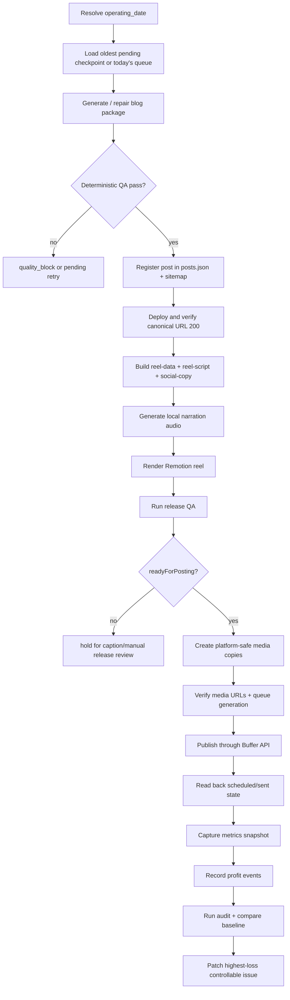

# Fused Distribution AI-Readable Content SOP

## Purpose

This document is the machine-oriented operating contract for Fused Distribution content production. It translates the human SOP into explicit steps, gates, completion proofs, failure rules, and evolution rules.

## Scope

This SOP covers:

- blog creation
- blog deployment verification
- local synthesis and voice creation for blog-derived reels
- Remotion-based reel rendering
- channel packaging and Buffer posting
- monitoring and completion proofs
- self-improvement and profit auditing

## Terminology

- `operating_date`: Pacific calendar date, always `America/Los_Angeles`
- `quality_block`: content or QA failure that must not be retried indefinitely
- `retryable_failure`: transient system failure that can resume from checkpoint
- `authoritative_readback`: live API or live site proof
- `completion_proof`: deterministic evidence that a stage is actually finished

## Accuracy Notes

- This repo contains `Chatterbox`, `Coqui XTTS v2`, `Zoe`, and `Whisper` references.
- This repo does not contain a tool named `Wispurr`.
- If an external summary requests `Wispurr`, interpret it as `Whisper` only if context is clearly subtitle or transcription related.
- The correct video composition tool in this repo is `Remotion`.

## System Contract

```yaml
owner:
  accountable_operator: Codex
  human_owner: Nick Hughes

time_rules:
  timezone: America/Los_Angeles
  operating_date_must_be_explicit: true
  utc_must_not_select_daily_ledger: true

hard_rules:
  - Never claim complete without authoritative readback.
  - Never publish a QA-failed post.
  - Never post a reel without release QA readiness.
  - Never weaken legal, financial, security, editorial, or approval gates.
  - Never treat a zero live Buffer queue as completion without backlog analysis.

completion_proofs:
  blog:
    - posts_json_registered
    - sitemap_present
    - canonical_url_http_200
  reel:
    - mp4_exists
    - release_qa_exists
    - ready_for_posting_true
  distribution:
    - buffer_readback_state_verified
    - channel_verified
    - retained_video_asset_verified
  evolution:
    - metrics_snapshot_written
    - profit_events_written
    - audit_report_written
    - tests_pass
```

## End-To-End Workflow Diagram



## Blog Creation SOP

### Required Inputs

```yaml
required_inputs:
  - target_brand
  - target_keyword
  - search_intent
  - competitor_gap
  - dated_queue_entry
```

### Required Artifacts Per Approved Slug

```yaml
required_blog_artifacts:
  - public/blog/<slug>/index.html
  - public/blog/<slug>/hero.jpg
  - public/blog/<slug>/reel-data.md
  - public/blog/<slug>/reel-script.md
  - public/blog/<slug>/social-copy.json
```

### Blog Build Sequence

1. Select the oldest pending date first. Do not skip an older pending checkpoint.
2. Generate or repair the draft package.
3. Run deterministic blog QA.
4. If QA fails for content reasons, quarantine as a quality block.
5. If QA passes, register the slug in `posts.json`.
6. Regenerate or verify `public/sitemap.xml`.
7. Deploy.
8. Verify the live canonical URL returns `200`.

### Blog Gate Conditions

```yaml
blog_block_if:
  - index_html_missing
  - hero_jpg_missing
  - reel_data_missing
  - reel_script_missing
  - social_copy_missing
  - deterministic_qa_failed
  - unsupported_claims_present
  - posts_json_registration_failed
```

### Blog Completion Proof

```yaml
blog_complete_if:
  posts_json_registered: true
  sitemap_contains_slug: true
  canonical_url_status: 200
  local_and_live_state_match: true
```

## Local Synthesis And Voice SOP

### Supported Local Voice Stack

```yaml
voice_stack:
  primary:
    name: Chatterbox
    role: production_voice_clone
    reference_sample: video/voice-sample/voice-reference.wav
  fallback_clone:
    name: Coqui XTTS v2
    role: fallback_local_voice_clone
  recovery_only:
    name: Zoe
    role: recovery_voice
    requires_explicit_approval: true
  captions:
    modes:
      - whisper
      - proportional
      - mixed
      - none
```

### Voice Creation Steps

1. Ensure `video/voice-sample/voice-reference.wav` exists for cloned voice paths.
2. Normalize narration text for TTS safety.
3. Generate per-segment audio.
4. Cache audio by `voice + normalized_narration`.
5. Refuse silent voice substitution.
6. Persist timing outputs for the render step.

### TTS Safety Rules

```yaml
tts_normalization_rules:
  - write USA instead of US
  - write percent instead of %
  - remove markdown citations from narration
  - remove raw URL narration
  - reject unsafe TTS token patterns
```

### Synthesis Failure Policy

```yaml
retryable_synthesis_failures:
  - local_runtime_temporarily_unavailable
  - timeout
  - interrupted_batch

quality_block_synthesis_failures:
  - narration_invalid_for_tts
  - script_missing_required_text
  - unsupported_voice_substitution_attempt
```

## Remotion Reel SOP

### Render Preconditions

```yaml
render_requires:
  - reel_data_present
  - reel_script_present
  - social_copy_present
  - audio_generated_or_recoverable
  - music_rights_approved
  - no_missing_display_text
  - no_timing_window_violation
```

### Render Command Layer

Use the checked-in Remotion workflow rather than ad hoc video composition. Rendering is allowed only after the upstream assets pass validation.

### Render Output Requirements

```yaml
render_output:
  format: H264_AAC_MP4
  resolution: 1080x1920
  required_sidecars:
    - release-qa.json
    - audio-timing.json
    - captions-meta.json
```

### Release QA Rules

```yaml
release_qa:
  pass_required: true
  manual_caption_review_required_for_proportional: true
  ready_for_posting_required: true
```

### Reel Blocking Conditions

```yaml
reel_block_if:
  - release_qa_missing
  - release_qa_pass_false
  - ready_for_posting_false
  - caption_review_not_completed_when_required
  - audio_rights_not_approved
```

## Social Packaging And Posting SOP

### Active Automated Channels

```yaml
channels:
  youtube:
    path: Buffer_API
  x:
    path: Buffer_API
  instagram:
    path: Buffer_API
  facebook_professional_profile:
    path: manual_native_only
```

### Packaging Rules

1. Do not publish directly from raw `video/out/<slug>/<slug>.mp4` unless it already satisfies the platform gate.
2. Create platform-safe copies in `public/reels/` and `public/reels-x/` when required.
3. Sync durable media for hosted access.
4. Verify hosted MP4 URLs before scheduling.
5. Generate validated queue files.
6. Publish only through the resumable live executor.
7. Confirm scheduled or sent state after create.

### Buffer Readback Rules

```yaml
distribution_complete_if:
  - live_post_exists
  - channel_matches_expected
  - state_in_scheduled_sending_sent
  - retained_asset_contains_video_mp4
```

### Zero-State Interpretation

```yaml
zero_queue_is_not_complete_if:
  - eligible_release_ready_backlog_exists
  - missing_sent_checkpoints_exist
  - instagram_recovery_backlog_exists
```

### Instagram Proof Rule

Instagram is not merely configured when the channel connects. It is considered operationally proven only after an automation-created reel is:

1. created successfully
2. read back successfully
3. retains its video asset
4. later reaches sent state

## Monitoring SOP

### Required Daily Evidence

```yaml
daily_evidence:
  - expected_queue_slugs
  - pending_or_complete_markers
  - posts_json_state
  - sitemap_state
  - live_website_verification
  - release_qa_state
  - buffer_channel_health
  - buffer_scheduled_sending_sent_state
  - retained_video_asset_state
  - metrics_snapshot
  - profit_event_ledger
```

### Monitoring Commands

```bash
npm run social:buffer:live -- status
npm run social:buffer:live -- channels
npm run social:buffer:metrics -- --date=YYYY-MM-DD
npm run profit:audit -- --date=YYYY-MM-DD
npm run profit:test
```

## Self-Improvement SOP

### Daily Control Loop

```yaml
daily_control_loop:
  - observe
  - compare
  - score
  - diagnose
  - improve
  - verify
  - record
```

### Rewards

Reward only evidence-backed outcomes such as:

- attributable gross profit
- conversions
- qualified leads
- verified distribution
- recovered checkpoints
- prevented failures
- high-quality delivery

### Penalties

Penalize:

- false success claims
- missed checkpoints
- bugs
- quality escapes
- manual rework
- unclear handoffs
- external publish failures

### Rule Promotion Policy

```yaml
rule_promotion_requires:
  comparable_samples_minimum: 3
  relative_improvement_minimum: 0.15
  required_fields:
    - evidence
    - expected_profit_mechanism
    - leading_metric
    - lagging_metric
    - guardrails
    - test_or_replay
    - review_date
    - rollback_condition
```

### Mutation Freeze Conditions

```yaml
freeze_sop_mutation_if:
  - critical_rule_violation
  - false_success_claim
  - security_or_privacy_violation
  - legal_or_financial_accuracy_breach
```

## Retry And Quality-Block Policy

### Retryable

```yaml
retryable_failures:
  - transport_failure
  - deployment_propagation_delay
  - temporary_api_failure
  - render_timeout
  - transient_local_runtime_failure
```

### Must Block

```yaml
quality_blocks:
  - undersized_or_invalid_article
  - unsupported_factual_claim
  - deterministic_qa_failure
  - release_qa_failure
  - missing_required_artifact_after_recovery_limit
```

## AI Agent Operating Instructions

1. Use Pacific dates explicitly in every metric, event, and audit command.
2. Never close a stage from local artifacts alone when authoritative readback exists.
3. Never convert a quality block into a retryable failure just to clear the queue.
4. Prefer deterministic validators, checkpoints, readback, idempotency, and tests over prose reminders.
5. Treat live website status, Buffer state, and release readiness as separate checks.
6. If a user asks for a non-existent tool name, map only to verified in-repo equivalents and say so.

## Human Translation

If a human needs a simpler summary, use the companion white paper:

- [AUTONOMOUS-CONTENT-OPS-WHITEPAPER.md](/Users/nick/projects/fuseddistribution/docs/AUTONOMOUS-CONTENT-OPS-WHITEPAPER.md)
