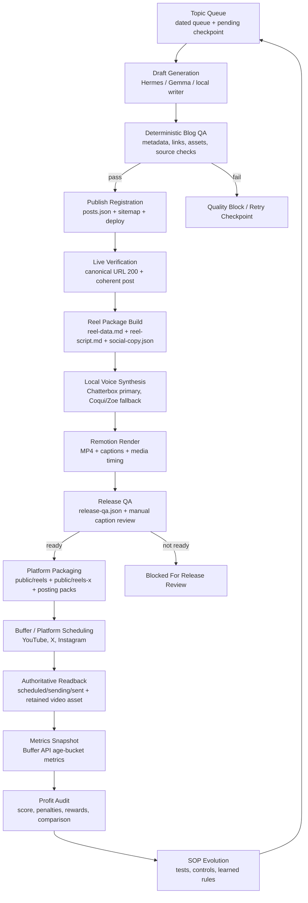

# Fused Distribution Autonomous Content Operations White Paper

## Executive Summary

Fused Distribution runs a production content system designed to publish useful blog posts, turn approved posts into short-form video assets, distribute those assets to social channels, and improve the operating system over time. The system is structured around one principle: no stage is considered complete until it has deterministic proof.

This workflow is not a generic AI content pipeline. It is a controlled publishing system with explicit gates, bounded retries, release quality checks, authoritative live verification, and a profit-oriented learning loop. Codex is the accountable operator. Drafting models and supporting automation contribute work, but they do not decide what is publishable.

The result is a workflow that is meant to protect trust, reduce rework, and convert daily publishing activity into a measurable operating system with clear business outcomes.

## Purpose

The operating model exists to achieve five business goals:

1. Publish complete, useful blog content that can earn search traffic and trust.
2. Convert approved blog content into readable, sound-off-friendly reels.
3. Distribute finished media through controlled channel-specific paths.
4. Detect failures early enough to avoid expensive rework and false success claims.
5. Improve the SOP continuously using evidence, tests, and comparable daily results.

## Operating Roles

### Codex

Codex is the production owner. It is responsible for:

- workflow integrity
- deterministic validation
- checkpoint recovery
- release quality enforcement
- authoritative readback
- metrics collection
- profit auditing
- governed SOP evolution

Codex is the only agent that can close a production checkpoint.

### Drafting Models

Hermes and Gemma can generate research notes, drafts, hooks, or supporting copy. Their output is treated as input, not truth. They help with throughput, but they do not approve publication.

### Downstream Render Layer

Remotion is used only after the blog package, reel package, captions, display text, and media inputs pass validation. Rendering is downstream of editorial and QA, not a substitute for either one.

## System Architecture

The workflow has five major layers:

1. Blog creation and approval
2. Reel synthesis and render
3. Distribution packaging and posting
4. Monitoring and live verification
5. Self-improvement and profit auditing

### Workflow Diagram

## Blog Creation Layer

The system begins with a dated queue in Pacific time. Every run uses `TZ=America/Los_Angeles` and treats the operating date as a first-class control, not a logging detail.

Each approved blog post must produce a complete package before publication:

- `index.html`
- `hero.jpg`
- `reel-data.md`
- `reel-script.md`
- `social-copy.json`

The blog stage is not complete when a draft exists. It is complete only when:

- the slug is registered in `posts.json`
- the slug is present in the sitemap
- the canonical live URL returns `200`
- the local and live registration state agree

If the system encounters a transient problem, it retries from a dated checkpoint. If it encounters an actual quality failure, it quarantines the slug under a blocked directory instead of retrying forever.

## Local Synthesis And Voice Creation

The repo’s local synthesis layer is centered on blog-to-reel narration, not spoken blog playback as a separate product.

### Verified Local Voice Stack In This Repo

- `Chatterbox` is the production voice cloning path.
- `Coqui XTTS v2` exists as a local cloned-voice fallback.
- `Zoe` exists as a recovery-only voice path and is not the default.
- `Whisper` is used for caption timing when available.
- Proportional captions are supported, but they are not described as Whisper-verified unless they actually are.

### Accuracy Note On “Wispurr”

This repository does not contain a tool named `Wispurr`. The closest in-repo match is `Whisper` caption processing plus the local TTS stack above. This white paper uses the repository’s actual implementation names to avoid drifting from production reality.

### Voice Creation Workflow

The cloned voice process depends on a local voice reference file:

- record a short voice sample
- save it to `video/voice-sample/voice-reference.wav`
- run local synthesis against the reel narration segments
- cache audio by narration text plus voice identity

That cache keying matters. If narration changes, stale speech cannot be reused accidentally.

### Why Local Synthesis Matters

The voice layer is local for three reasons:

1. It keeps production voice consistent.
2. It allows deterministic asset generation inside the same workflow.
3. It reduces dependence on external hosted narration systems during unattended runs.

## Reel Creation With Remotion

The video layer turns each approved blog package into a 1080x1920 MP4. Remotion is the composition engine, but it is only one part of the process.

### Inputs

Remotion receives:

- approved reel script
- extracted facts and media queries from `reel-data.md`
- measured narration timing
- captions metadata
- blog imagery and fallback images
- approved music metadata

### Controls

Before render, the system checks:

- narration timing windows
- missing display text
- unsupported citations in spoken lines
- unsafe TTS tokens
- chart integrity
- caption mode integrity
- audio-rights status

After render, the system checks:

- output existence
- output format
- caption sync readiness
- release QA state

An MP4 alone is not enough. The file must also have a passing `release-qa.json`, and `readyForPosting=true` is required before scheduling.

## Distribution And Posting

Distribution is handled as a controlled publishing layer, not a best-effort side effect.

### Platform Strategy

The active automated path is:

- YouTube via Buffer API
- X via Buffer API
- Instagram via Buffer API

Facebook professional profile posting remains a separate manual-native path.

### Distribution Rules

The system does not schedule directly from raw render output unless the asset already meets platform rules. It first prepares durable public copies, verifies them, and then creates platform queue files.

Distribution is only considered complete when live readback confirms:

- the correct channel
- the correct due or sent state
- the retained video asset

A zero-post queue is not success by itself. It is only healthy if there is no eligible backlog or if the eligible backlog is already confirmed sent.

## Monitoring And Completion Proofs

The workflow is evidence-driven. Each stage has an authoritative proof:

### Blog

- `posts.json` registration
- sitemap presence
- live canonical URL `200`

### Reel

- H.264/AAC MP4
- `release-qa.json`
- `readyForPosting=true`

### Distribution

- Buffer API readback
- verified channel
- verified state
- retained video asset

### Evolution

- metrics snapshot
- event ledger
- dated audit report
- passing tests
- explicit rule decision

## Failure Containment

The system is designed to distinguish temporary failure from actual content failure.

### Retryable Failures

- transport outages
- deployment propagation lag
- transient render issues
- temporary API failures

### Blocking Failures

- weak or invalid content
- failed deterministic QA
- unsupported factual claims
- missing required assets
- release QA not ready

Retryable failures return to checkpoints. Blocking failures move into quarantine and stay visible.

## Evolution And Self-Improvement

The self-improvement system is one of the core differentiators of this workflow. The pipeline does not just publish content; it audits itself.

### Daily Control Loop

Every operating day follows this pattern:

1. observe outcomes
2. compare to trailing baseline
3. score rewards and penalties
4. diagnose the smallest controllable cause
5. improve the control
6. verify the change with tests or replay
7. record the result

### Monitoring Inputs

The monitoring layer tracks:

- pending and complete checkpoints
- blog publication state
- reel release readiness
- Buffer queue state
- sent proofs
- performance snapshots
- qualified leads, conversions, revenue, and gross profit when available

### Learned Rules

A rule can be promoted only when it has:

- evidence
- an expected profit mechanism
- a measurable success condition
- guardrails
- a test or replay
- a review date
- a rollback condition

This keeps SOP evolution additive and reversible instead of turning into uncontrolled prompt drift.

## Governance And Hard Stops

The system explicitly refuses certain shortcuts:

- no false live or complete claims without readback
- no weakening of editorial QA
- no weakening of release QA
- no weakening of secrets handling
- no weakening of legal or financial accuracy controls
- no silent bypass of user approval boundaries

If a critical control is violated, automatic SOP mutation freezes until a human reviews the issue.

## Why This Model Is Shareable

This operating design is useful beyond one workflow because it demonstrates a practical model for AI-assisted content operations:

- AI can accelerate drafting without owning approval.
- deterministic gates reduce hallucination risk
- checkpoints make unattended recovery practical
- platform readback prevents fake completion
- metrics and audits turn output into learning

The core lesson is simple: automation becomes durable when completion proofs, rollback paths, and profit-aware feedback are built into the workflow itself.

## Recommended Audience

This white paper is useful for:

- founders evaluating AI publishing workflows
- operators building unattended content pipelines
- technical product owners who need reliable AI-assisted publishing
- teams that want evidence-backed SOP evolution rather than prompt folklore

## Closing

Fused Distribution’s content system is best understood as an autonomous publishing control loop, not just a set of scripts. Its value comes from governed execution, explicit gates, authoritative verification, and continuous measured improvement.

That makes it suitable not only for content production, but as a model for any AI-assisted workflow where trust, recoverability, and business outcomes matter.
